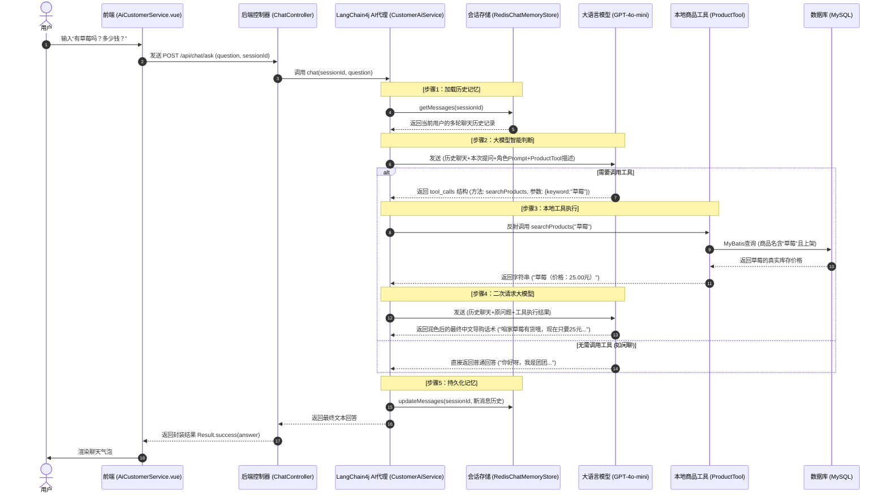

# AI 模块架构升级 — LangChain4j 版本升级

## 问题根因

AI 导购的 Function Calling 不生效，根因是 **LangChain4j 版本过旧**：
- 0.24.0 使用旧版 OpenAI `functions` 参数格式
- MiMo 等新模型只支持新版 `tools` 参数格式
- 模型收不到工具定义 → 在文本里乱输出

## 解决方案

升级 Java 8 → 17，LangChain4j 0.24.0 → 1.15.1。

## 修改清单

| 文件 | 改动 |
|------|------|
| `pom.xml` | Java 1.8→17，新增 `langchain4j.version` 属性，版本 1.15.1 |
| `AiConfig.java` | `ChatLanguageModel`→`ChatModel`，`.chatLanguageModel()`→`.chatModel()` |
| `AiController.java` | `ChatLanguageModel`→`ChatModel` |
| `RedisChatMemoryStore.java` | `getMessages()` 增加 try-catch 容错，旧格式数据自动清除 |
| `ChatController.java` | 回退到最简洁版本（55行），零兜底逻辑 |
| `CustomerAiService.java` | 恢复 Function Calling 工具调用指令 |
| `ProductTool.java` | 恢复 `@Tool` 注解，新增 `@P` 参数描述 |

## 删除的文件

- `IntentAnalysisService.java`（确定性架构废弃）
- `IntentResult.java`（确定性架构废弃）

## 验证结果

- `mvn clean compile` → BUILD SUCCESS ✅
- 实测 "可乐有没有" → Function Calling 自动调用 `searchProducts` → 返回真实价格 ✅

---

## 现在的 AI 模块实现链路

当前 AI 模块分为两个核心功能链路：**智能导购（多轮对话+工具调用）** 与 **推广文案生成（单次生成）**。

### 1. 智能导购链路（Function Calling + 记忆持久化）

### 2. 商品推广文案生成链路（单次文本生成）

1. **前端触发**：商家在商品管理界面（`ProductManage.vue`）填写商品名称与卖点关键词，点击“AI生成文案”。
2. **后端接收**：`AiController` 拦截 `/api/admin/ai/generate` 请求，提取参数。
3. **无记忆调用**：`AiController` 调用 `AiAssistant.generateProductCopy(prompt)`。
4. **单次模型交互**：`AiAssistant`（LangChain4j 动态代理）直接将带有格式限定 Prompt 的请求发送给 `ChatModel`，大模型返回精简文案（50字内）。
5. **前端填充**：前端收到成功响应后，将文案自动填充并覆盖到“商品描述”文本框中。

### 3. README.md 说明更新
同步更新了项目根目录下的 [README.md](file:///e:/community-mall/community-mall-master/README.md)：
* 后端 JDK 版本依赖要求从 `1.8+` 提升至 `17+`。
* LangChain4j 的版本说明从 `0.24.0` 升级为 `1.15.1`，并新增说明“全新工具调用及自主 Agent 决策”。

